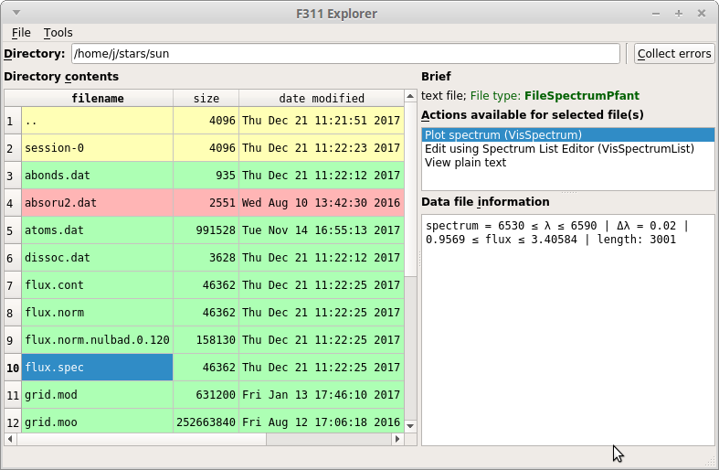

F311 -- collaborative model for Python programmers in Astronomy
===============================================================

Welcome!

Most of the programming work in science is arguably related to loading, saving, visualizing, and manipulating data
files somehow. For some, it would be nice a common interface to handle these several data file types.

Project F311 provides a common ground to create new Python packages
(herein called *collaborator packages*)
containing new
file handling and visualization routines, allowing these file types to be accessed through the
``explorer.py`` (:numref:`figexplorer`) application in a plugin-like fashion.

In addition, F311 provide a ``programs.py`` scripts that work as an index to all scripts included in
all collaborator packages.

By the end of 2017, the following projects were listed as *collaborators*:

- ariastro (https://github.com/aricorte/ariastro)
- PyFANT (source: https://github.com/trevisanj/pyfant; docs: https://trevisanj.github.io/pyfant)
- AOSSS (source: https://github.com/trevisanj/aosss; docs: https://trevisanj.github.io/aosss)
- F311 itself (source: https://github.com/trevisanj/F311; docs: https://trevisanj.github.io/f311)

Project F311 is a collaborator to itself, providing classes to handle 1D spectral files (such as FITS, "x-y"),
and a few scripts as listed below.

.. note:: Projects **PyFANT** and **AOSSS** were recently split from F311 and are now separate
          projects. If you are looking for the functionalities in these projects, please refer
          to their respective links.

Quick install
-------------

.. code:: shell

    pip install f311

Or visit the :doc:`installation page <install>`.

Importing the API
-----------------

The F311 API (application programming interface) can be imported like this::

    import f311

Applications (scripts)
----------------------

The following applications are included in package ``f311``:

* :doc:`explorer.py <autoscripts/script-explorer>`: F311 Explorer -- file manager-like GUI (graphical user interface) (:numref:`figexplorer`)
* :doc:`programs.py <autoscripts/script-programs>`: Lists all programs available across all *collaborators packages*
* :doc:`cut-spectrum.py <autoscripts/script-cut-spectrum>`: Cuts spectrum file to wavelength interval specified
* :doc:`plot-spectra.py <autoscripts/script-plot-spectra>`: Plots spectra on screen or creates PDF file

.. _figexplorer:

   -- screenshot of ``explorer.py``.

Acknowledgement
---------------

The project started in 2015 at IAG-USP (Institute of Astronomy, Geophysics and Atmospheric Sciences
at University of São Paulo, Brazil).

Partially funded by FAPESP - Research Support Foundation of the State of São Paulo, Brazil (2015-2017).

Contents
========

.. toctree::
    :maxdepth: 1

    install
    scripts
    api
    examples
    autodoc/modules

.. only:: html

    API Reference
    -------------

    * :ref:`genindex` (all symbols listed alphabetically)
    * :ref:`modindex` (whole f311 package tree)

    .. hint:: You can also search using the sidebar box.

